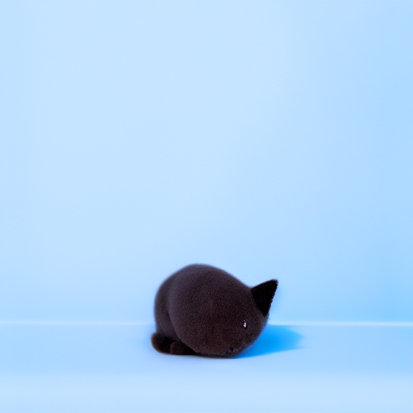
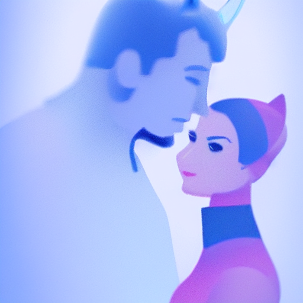

# Artistic Style Transfer with Advanced Loss Functions

This project implements an advanced stable diffusion model with multiple artistic style transfers and sophisticated loss functions. It includes a comprehensive analysis suite and a user-friendly web interface.

## 🌟 Features

### 1. Multiple Style Transfers
- **Midjourney Style**: Professional, detailed artistic style
- **Black and White Design**: Monochromatic artistic designs
- **Cat Toy**: Playful and cute style
- **Madhubani Art**: Traditional Indian folk art style
- **Rahkshi Bionicle**: Mechanical and sci-fi style

### 2. Advanced Loss Functions
- **Blue Loss**: Standard blue-channel optimization
- **Color Loss**: Enhanced color-aware optimization
- **EPS Loss**: Epsilon prediction optimization
- **TAP Loss**: Texture-aware perceptual loss
- **SA Loss**: Self-attention guided loss

### 3. Analysis Suite
- **Similarity Metrics**:
  - SSIM (Structural Similarity Index)
  - PSNR (Peak Signal-to-Noise Ratio)
  - LPIPS (Learned Perceptual Image Patch Similarity)
- **Color Analysis**:
  - RGB Distribution
  - Edge Intensity
  - Loss Value Comparisons

### 4. Web Interface
- Interactive Gradio-based UI
- Real-time image generation
- Style and loss function selection
- Customizable parameters
- Progress tracking

## 📋 Requirements

```bash
python >= 3.8
CUDA-capable GPU (recommended)
8GB+ RAM
```

## 🚀 Installation

1. Clone the repository:
```bash
git clone https://github.com/dbvb2k/DBVB-ERAV3-S17.git
cd DBVB-ERAV3-S17
```

2. Install dependencies:
```bash
pip install -r requirements.txt
```

3. Set up Hugging Face token:
```bash
export HF_TOKEN="your_token_here"  # Linux/Mac
set HF_TOKEN=your_token_here       # Windows
```

## 💻 Usage

### 1. Web Interface
```bash
python app.py
```
Access the interface at `http://localhost:7860`

### 2. Command Line Generation
```bash
python stable_diffusion.py
```

### 3. Analysis
```bash
python loss_analysis.py
```

## 📂 Project Structure

```
.
├── app.py                  # Gradio web interface
├── stable_diffusion.py     # Main generation script
├── loss_analysis.py        # Analysis suite
├── Losses.py              # Loss function implementations
├── requirements.txt        # Dependencies
└── generated_images/      # Main output directory
    ├── prompt_1_a_serene_landscape/
    │   └── 20240321_123456/        # Timestamp
    │       ├── midjourney/
    │       │   ├── blue/
    │       │   │   └── midjourney.png
    │       │   ├── color/
    │       │   ├── eps/
    │       │   ├── tap/
    │       │   ├── sa/
    │       │   └── generation_info.txt
    │       ├── cat-toy/
    │       │   └── [similar structure]
    │       ├── madhubani-art/
    │       │   └── [similar structure]
    │       ├── analysis/
    │       │   ├── analysis_midjourney.png
    │       │   ├── analysis_cat-toy.png
    │       │   ├── analysis_madhubani-art.png
    │       │   └── analysis_summary.txt
    │       └── prompt_info.txt
    └── [other prompt directories]
```

## 📊 Output Organization

### 1. Directory Structure
- **Base Directory**: `generated_images/`
- **Prompt Directories**: Named using first few words of the prompt
- **Timestamp Directories**: Format: YYYYMMDD_HHMMSS
- **Style Directories**: One for each style
- **Loss Type Directories**: blue, color, eps, tap, sa

### 2. Generated Files
- **Images**: `{style_name}.png` in each loss directory
- **Style Info**: `generation_info.txt` in each style directory
- **Prompt Info**: `prompt_info.txt` in timestamp directory
- **Analysis**: Complete analysis in the analysis directory

### 3. Analysis Outputs
Each prompt run includes:
- Individual style analysis plots
- Comparative metrics
- Loss function effectiveness
- Detailed analysis summary

## 📊 Example Outputs

### Run 1: "A serene landscape with mountains and a lake"
<table>
<tr>
<td></td>
<td>
<b>Details:</b><br>
• Location: prompt_1_serene_landscape_mountains_lake<br>
• Timestamp: 20250307_184946<br>
• Styles: 5 different artistic interpretations<br>
• Loss Functions: Blue, Color, EPS, TAP, SA<br>
<br>
<a href="analysis_prompt1.md">📊 View Full Analysis</a>
</td>
</tr>
</table>

### Run 2: "A toy cat with contrasting colors"
<table>
<tr>
<td></td>
<td>
<b>Details:</b><br>
• Location: prompt_2_toy_cat_contrasting_colors<br>
• Timestamp: 20250307_184946<br>
• Styles: 5 different artistic interpretations<br>
• Loss Functions: Blue, Color, EPS, TAP, SA<br>
<br>
<a href="analysis_prompt2.md">📊 View Full Analysis</a>
</td>
</tr>
</table>

### Run 3: "Iron man and catwoman in traditional attire"
<table>
<tr>
<td></td>
<td>
<b>Details:</b><br>
• Location: prompt_3_iron_man_catwoman_traditional<br>
• Timestamp: 20250307_184946<br>
• Styles: 5 different artistic interpretations<br>
• Loss Functions: Blue, Color, EPS, TAP, SA<br>
<br>
<a href="analysis_prompt3.md">📊 View Full Analysis</a>
</td>
</tr>
</table>

### Analysis Components

Each detailed analysis includes:
1. **Complete Style Grid**: All styles with all loss functions
2. **Metrics Visualization**: SSIM, PSNR, and LPIPS comparisons
3. **Color Analysis**: RGB distribution charts
4. **Edge Detection**: Comparative edge intensity analysis
5. **Loss Comparisons**: Normalized loss value comparisons

### Key Metrics Explained

1. **SSIM (Structural Similarity Index)**
   - Range: 0 to 1 (higher is better)
   - Measures structural similarity between images
   - Values > 0.9 indicate high structural similarity

2. **PSNR (Peak Signal-to-Noise Ratio)**
   - Measured in dB (higher is better)
   - Typical range: 20-50 dB
   - Values > 30 dB generally indicate good quality

3. **LPIPS (Learned Perceptual Image Patch Similarity)**
   - Range: 0 to 1 (lower is better)
   - Measures perceptual similarity
   - Values < 0.5 indicate good perceptual similarity

### Loss Function Effects

1. **Blue Loss**
   - Baseline for comparison
   - Focuses on blue channel optimization
   - Generally produces balanced images

2. **Color Loss**
   - Enhances color vibrancy
   - Maintains color relationships
   - May produce more saturated results

3. **EPS Loss**
   - Focuses on noise prediction
   - Can produce sharper details
   - May enhance texture quality

4. **TAP Loss**
   - Texture-aware optimization
   - Preserves fine details
   - Can enhance pattern consistency

5. **SA Loss**
   - Self-attention guided
   - Improves global coherence
   - Can enhance overall composition

## 🔧 Advanced Configuration

### Loss Scales
```python
loss_scales = {
    'Blue': 100.0,
    'Color': 100.0,
    'EPS': 0.1,
    'TAP': 0.5,
    'SA': 1.0
}
```

### Generation Parameters
- Height/Width: 512x512
- Inference Steps: 30
- Guidance Scale: 7.5
- Random Seeds: [42, 123, 456, 789, 101112]

## 📝 License

This project is licensed under the MIT License - see the [LICENSE](LICENSE) file for details.

## 🙏 Acknowledgments

- Stable Diffusion by CompVis
- Hugging Face for model hosting
- Gradio for the web interface
- CLIP model by OpenAI
- VGG16 for perceptual losses

## 👥 Contributing

1. Fork the repository
2. Create your feature branch
3. Commit your changes
4. Push to the branch
5. Create a new Pull Request

## 📧 Contact

Your Name - your.email@example.com
Project Link: [https://github.com/dbvb2k/DBVB-ERAV3-S17](https://github.com/dbvb2k/DBVB-ERAV3-S17) 