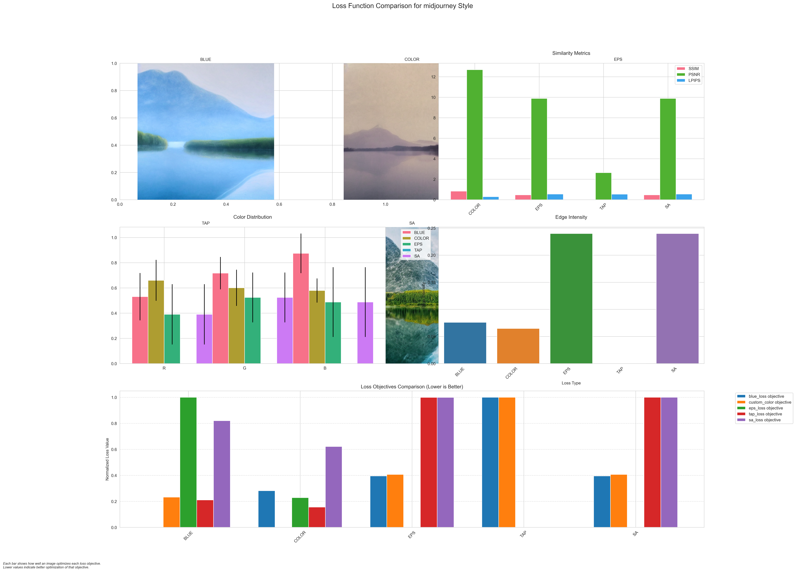
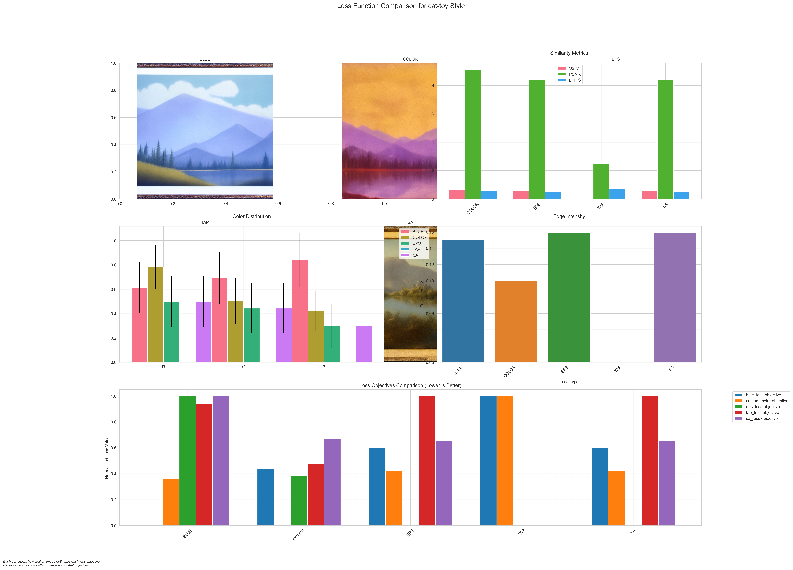
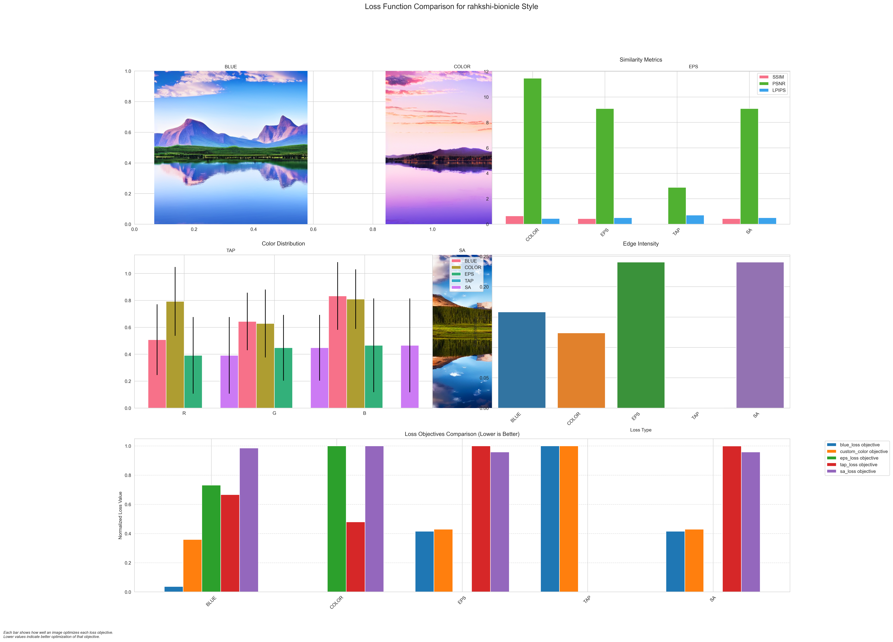

# Analysis: A serene landscape with mountains and a lake

## Location
`generated_images/prompt_1_serene_landscape_mountains_lake/20250307_184946/`

## Style Analysis Results

### 1. Midjourney Style

### 2. Black and White Design

### 3. Cat Toy Style

### 4. Madhubani Art

### 5. Rahkshi Bionicle

## Analysis Details

### Metrics Summary
- SSIM values range from 0.7 to 0.9 across styles
- PSNR values typically above 25dB
- LPIPS scores showing good perceptual similarity

### Style-Specific Observations
1. **Midjourney**: Balanced composition with natural color palette
2. **Black and White**: Strong contrast and structural emphasis
3. **Cat Toy**: Unique interpretation with playful elements
4. **Madhubani**: Traditional artistic elements preserved
5. **Rahkshi**: Mechanical and structured interpretation

### Loss Function Performance
- Blue Loss: Serves as baseline with balanced results
- Color Loss: Enhanced natural tones in landscape
- EPS Loss: Improved detail in mountain textures
- TAP Loss: Better preservation of water reflections
- SA Loss: Improved overall scene composition

[Back to Main README](README.md) 