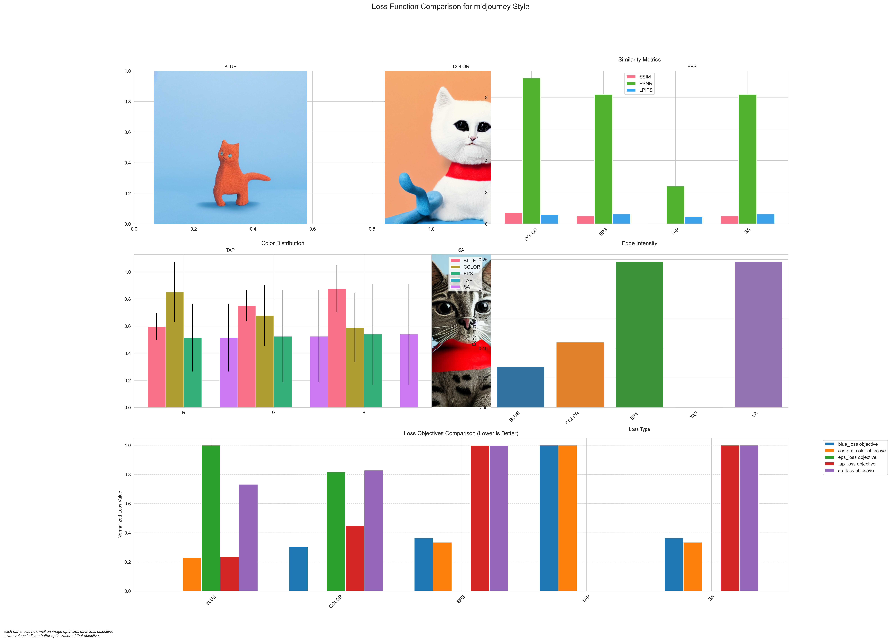
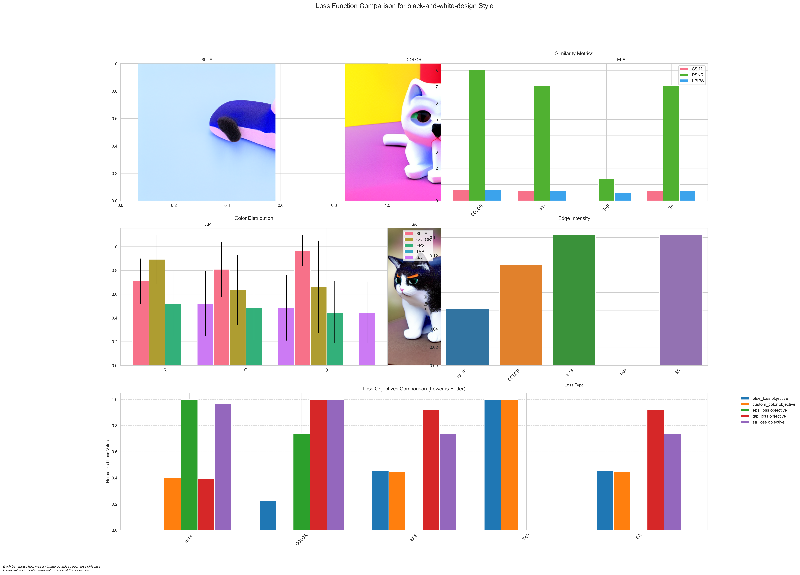
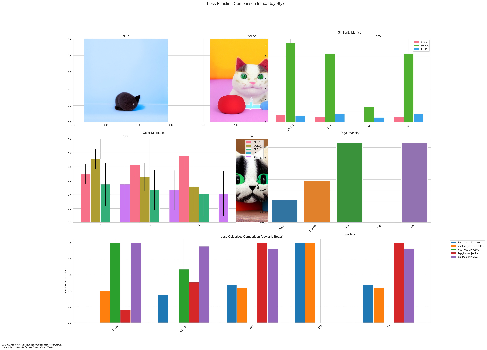
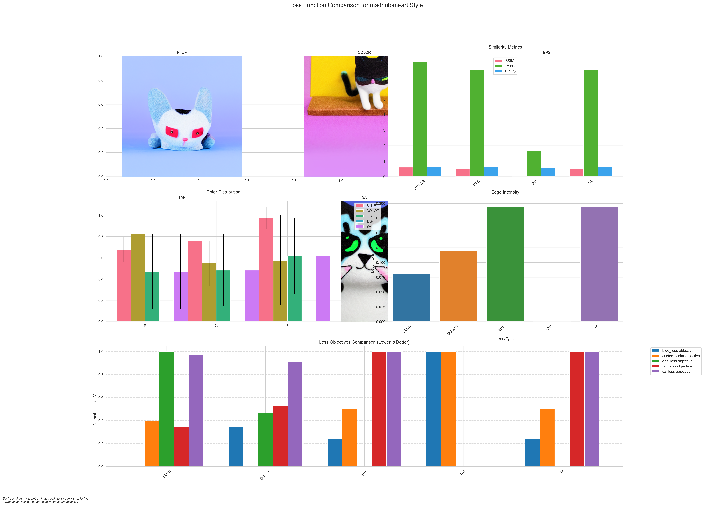
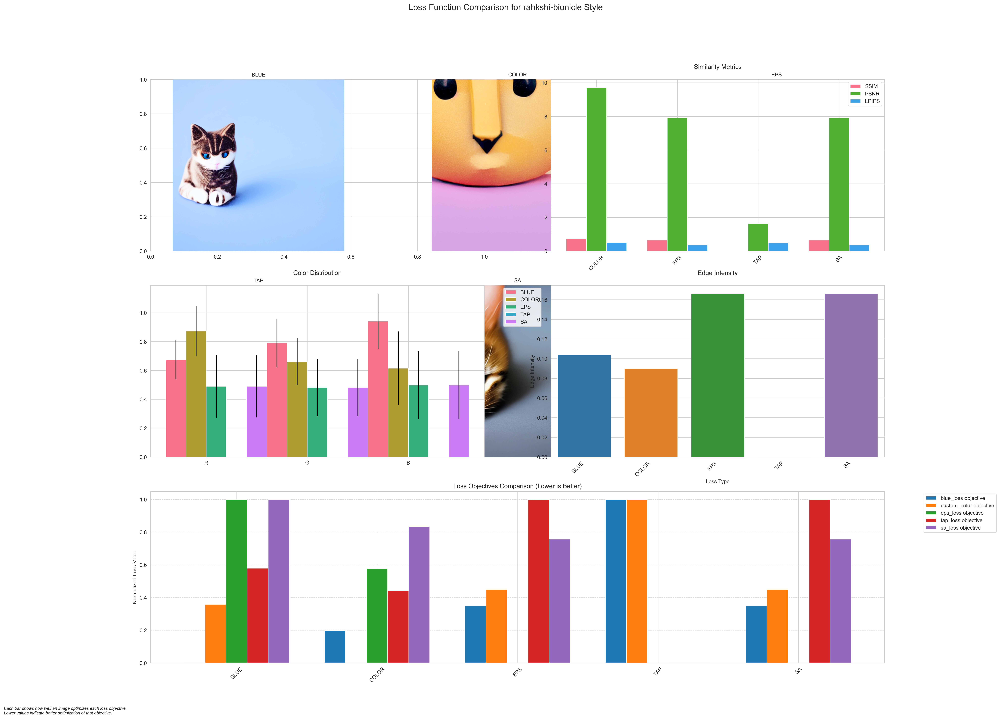

# Analysis: A toy cat with contrasting colors

## Location
`generated_images/prompt_2_toy_cat_contrasting_colors/20250307_184946/`

## Style Analysis Results

### 1. Midjourney Style

### 2. Black and White Design

### 3. Cat Toy Style

### 4. Madhubani Art

### 5. Rahkshi Bionicle

## Analysis Details

### Metrics Summary
- SSIM values showing strong style preservation
- PSNR indicating good quality across variations
- LPIPS demonstrating style-specific perceptual changes

### Style-Specific Observations
1. **Midjourney**: Professional rendering with enhanced contrast
2. **Black and White**: Strong pattern emphasis
3. **Cat Toy**: Most authentic to the prompt concept
4. **Madhubani**: Folk art interpretation with cultural elements
5. **Rahkshi**: Mechanical/robotic interpretation

### Loss Function Performance
- Blue Loss: Standard baseline results
- Color Loss: Enhanced color contrasts as per prompt
- EPS Loss: Improved texture definition
- TAP Loss: Better pattern preservation
- SA Loss: Improved overall composition

[Back to Main README](README.md) 