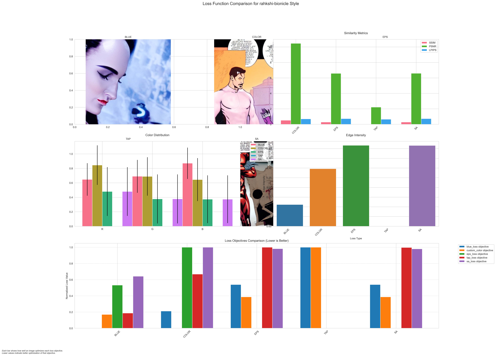

# Analysis: Iron man and catwoman in traditional attire

## Location
`generated_images/prompt_3_iron_man_catwoman_traditional/20250307_184946/`

## Style Analysis Results

### 1. Midjourney Style

### 2. Black and White Design

### 3. Cat Toy Style

### 4. Madhubani Art

### 5. Rahkshi Bionicle

## Analysis Details

### Metrics Summary
- SSIM showing unique style adaptations
- PSNR values reflecting style-specific quality
- LPIPS demonstrating creative interpretations

### Style-Specific Observations
1. **Midjourney**: Balanced modern and traditional elements
2. **Black and White**: Emphasis on costume details
3. **Cat Toy**: Playful interpretation of characters
4. **Madhubani**: Strong traditional art influence
5. **Rahkshi**: Sci-fi meets traditional aesthetic

### Loss Function Performance
- Blue Loss: Baseline character rendering
- Color Loss: Enhanced costume colors
- EPS Loss: Improved detail in traditional elements
- TAP Loss: Better texture in clothing
- SA Loss: Improved character interaction

[Back to Main README](README.md) 